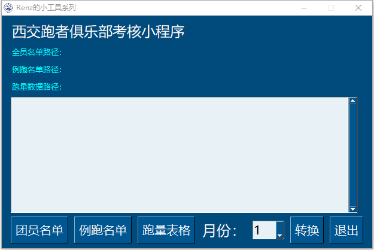
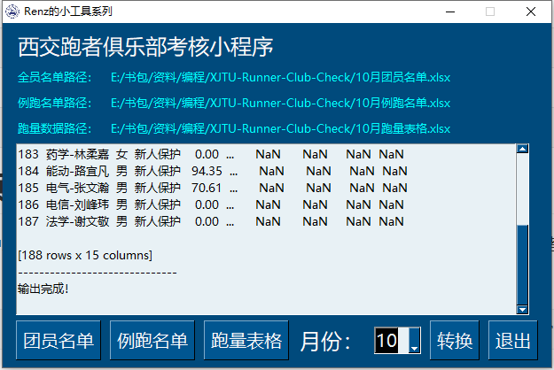

# XJTU-Runner-Club-Check
[西交跑者俱乐部定期考核小程序](https://github.com/Renzehua1998/fill_docx)

链接：https://pan.baidu.com/s/1rEh6ADhkf-Aa0IwDnOuqYg?pwd=renz 
提取码：renz



## 使用方法

1. 分别点击下方按钮选择当月团员名单、例跑参与名单和跑量统计表格（选中会显示到上方）
2. 选择月份，用于生成文件名
3. 点击转换，输出框会提示信息，显示输出完成即可查看



**三张表格结构如下**：

- 团员名单

| 名字      | 性别 | 特殊情况 |
| --------- | ---- | -------- |
| 电信-张三 | 男   | 工作组   |
| 机械-李四 | 女   | 请假     |
| 能动-王五 | 男   |          |

- 例跑名单

| 10.5例跑     | 10.6例跑  | 10.10例跑 | 10.19例跑    |
| ------------ | --------- | --------- | ------------ |
| 1. 电信-张三 | 电信-张三 | 机械-李四 | 张三（试听） |
| 2. 能动-王五 | 王五      |           | 机械-李四    |

- 跑量表格

| 名字      | 性别 | 月里程（KM） |
| --------- | ---- | ------------ |
| 电信-张三 | 男   | 150          |
| 机械-李四 | 女   | 100          |

## 注意事项

1. 团员名单和跑量表格提到的列名必须完全一致
2. 团员名单中尽量将名字命名为“学院-姓名”的形式，例跑名单和跑量表格中只要有姓名都会匹配
3. 默认男生月跑量40km、女生月跑量30km
4. 跑量不够且未参加例跑且没有特殊情况的会在最后一列标注不达标，手动处理标“1”的人即可

## 源码使用

### 1. 安装python环境

- 可以基于anaconda创建虚拟环境，根据requirements.txt里面的第三方库包进行安装。

```bash
conda create -n runnerclub python=3.11.2
conda activate runnerclub
pip install -r requirements.txt
```

- 然后直接运行即可

```bash
python generation.py
```

### 2. 打包成exe

```bash
pyinstaller -F -w -i RunnerClub.ico --add-data "RunnerClub.ico;." generation.py
```

